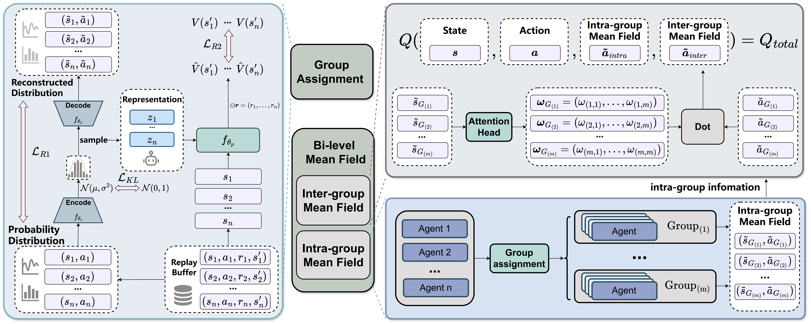

# [ECAI 2025] Bi-level Mean Field: Dynamic Grouping for Large-Scale MARL

[](https://arxiv.org/abs/2505.06706)

Official codebase for the paper [Bi-level Mean Field: Dynamic Grouping for Large-Scale MARL](https://arxiv.org/abs/2505.06706).


## Overview



**Abstract:** Large-scale Multi-Agent Reinforcement Learning~(MARL) often suffers from the curse of dimensionality, as the exponential growth in agent interactions significantly increases computational complexity and impedes learning efficiency. To mitigate this, existing efforts that rely on Mean Field~(MF) simplify the interaction landscape by approximating neighboring agents as a single \textit{mean} agent, thus reducing overall complexity to pairwise interactions. However, these MF methods inevitably fail to account for individual differences, leading to aggregation noise caused by inaccurate iterative updates during MF learning. In this paper, we propose a Bi-level Mean Field~(BMF) method to capture agent diversity with dynamic grouping in large-scale MARL, which can alleviate aggregation noise via bi-level interaction. Specifically, BMF introduces a dynamic group assignment~module, which employs a Variational AutoEncoder~(VAE) to learn the representations of agents, facilitating their dynamic grouping over time. Furthermore, we propose a bi-level interaction module to model both inter- and intra-group interactions for effective neighboring aggregation. Experiments across various tasks demonstrate that the proposed BMF yields results superior to the state-of-the-art methods.


## Installation

We install dependencies based on [MAgent](https://github.com/geek-ai/MAgent).

Please execute the following command:

```shell
git clone git@github.com:geek-ai/MAgent.git
cd MAgent

sudo apt-get install cmake libboost-system-dev libjsoncpp-dev libwebsocketpp-dev

bash build.sh
export PYTHONPATH=$(pwd)/python:$PYTHONPATH
```


## Running experiments

#### Training

You can train the model using the following command.

```bash
python train.py
```

And the 


## Citation

If you find this work useful for your research, please cite our paper:

```
@inproceedings{zheng2025BMF,
  title     = {Bi-level Mean Field: Dynamic Grouping for Large-Scale MARL},
  author    = {Zheng, Yuxuan and Zhou, Yihe and Xu, Feiyang and Song, Mingli and Liu, Shunyu},
  booktitle = {European Conference on Artificial Intelligence},
  year      = {2025},
}
```

## Contact

Please feel free to contact me via email (<zyxuan@zju.edu.cn>) if you are interested in my research :)